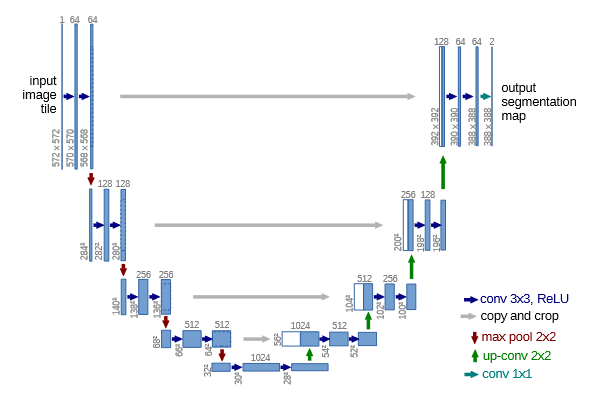

# U-Net

  

The U-Net is a CNN architecture that was originally designed for image segmentation. It is also a core component in the architecture of Diffusion models.

# Testing

The train script trains the model on the [Pascal VOC dataset](http://host.robots.ox.ac.uk/pascal/VOC/).

I have also included the `create_mask` function that allows you to convert from the model output to an actual image.